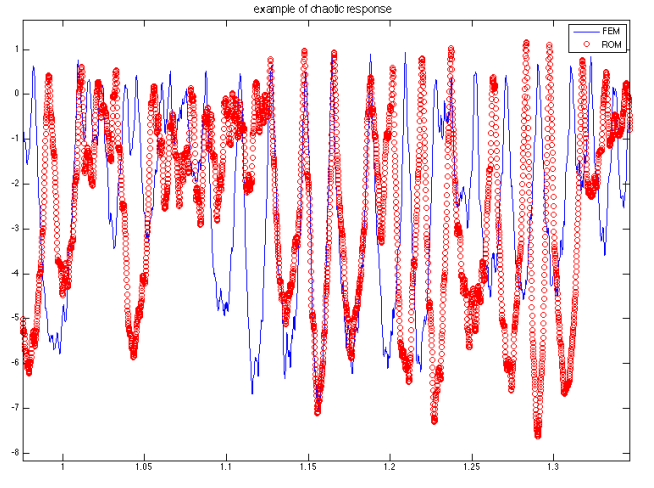

# ArchROM
Reduced-Order model for dynamics of slender archs subject to cyclic loads.

## Table of Contents

- [Installation](#installation)
- [Theory](#theory)
- [Usage](#usage)
  - [Extracting POD basis from high-fidelity simulations.](#extracting basis)
  - [Using POD basis](#using pod basis)
- [Highlights]
- [Examples]
- [Acknoledgments]

# Installation
[(Back to top)](#table-of-contents)

It just requires MATLAB, version 2015 or newer is recommended.

# Theory
[(Back to top)](#table-of-contents)

- Extract basis
- Compute ROM solutions

# Usage
[(Back to top)](#table-of-contents)

Interactive launch

Passing txt files

## Extracting Basis
[(Back to top)](#table-of-contents)

Show example

## Using POD basis
[(Back to top)](#table-of-contents)

Show example

# Highlights

add highlights

# Examples

Probabilistic snap-through boundary.

<!--  -->

<!--  -->

<!--  -->

# Acknolegments

add acknoledgment

<!--  -->

<!--  -->

<!--  -->

